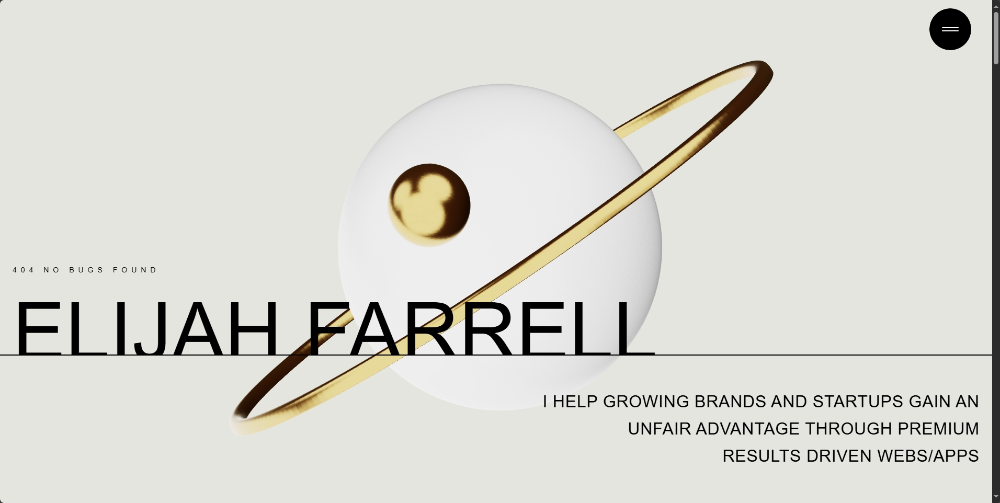

# 🌐 3D Awwwards-Level Developer Portfolio Template

<a href="https://awwwards-portfolio-template.vercel.app/" target="_blank">
  
</a>

### Built with React, GSAP, Three.js, TailwindCSS

This is a fully animated, interactive, 3D developer portfolio template designed to **impress clients, recruiters, and hiring managers**. It's more than a portfolio—it's a web experience built with production-level code, scroll-based animations, and real-world best practices.


---

## 🚀 Tech Stack

| Technology       | Description                             |
| ---------------- | --------------------------------------- |
| **React (Vite)** | Fast dev server and production bundling |
| **Tailwind CSS** | Utility-first styling for components    |
| **GSAP**         | General animations and transitions |
| **Motion**         | Scroll-based marquee animations |
| **Three.js**     | 3D scenes powered by React Three Fiber  |
| **Drei**         | Useful helpers for 3D rendering         |

---

## 📁 Features

- 🔥 3D Hero Section with animated planet and golden ring
- 🧩 Smooth slide-in Navbar with staggered link animations
- 🎯 Scroll-triggered Service Summary with horizontal word motion
- 🖼️ Works section with hover overlays and interactive previews
- ✍️ About section with clip-path image reveal + typewriter text
- 🏁 Marquee-based Contact Summary and CTA
- 💼 Fully responsive and accessible on all screen sizes

---

## 📦 Setup & Installation

```bash
git clone https://github.com/elijah-farrell/portfolio-template02.git
cd portfolio-template02
npm install
npm run dev
```

> Open http://localhost:5173 in your browser.

---

## 🛠️ Customization Tips

- Change text, images, and links in /constants/index.js

- Update 3D models and scene in Hero.jsx

- Add your own contact info in Contact.jsx

- Adjust colors, fonts, and layout via tailwind.config.js

---
---

## 📣 About This Template

This is a modern, 3D animated portfolio template perfect for developers, designers, and creatives who want to showcase their work in an impressive way.

---